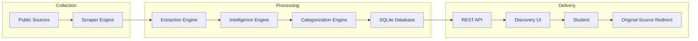
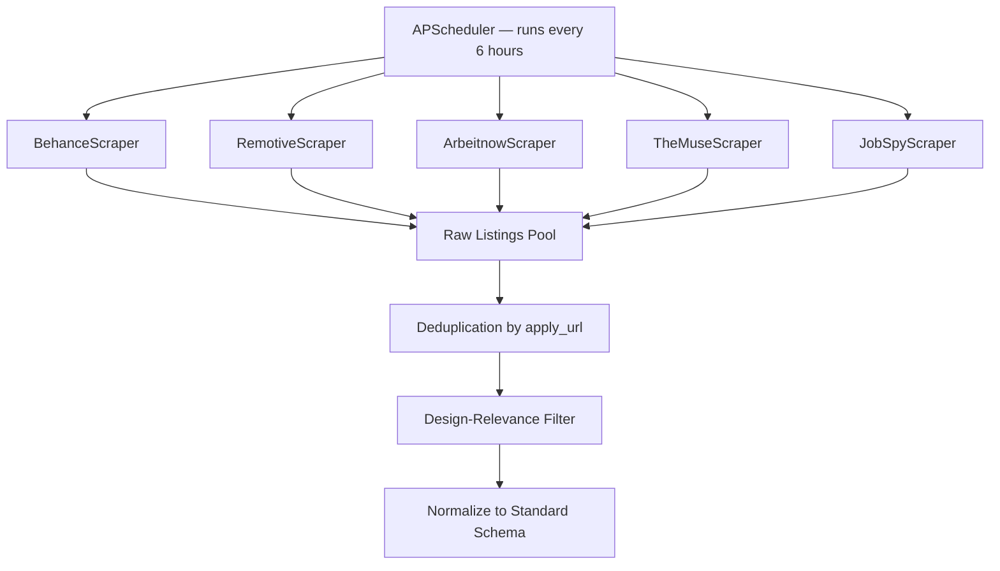
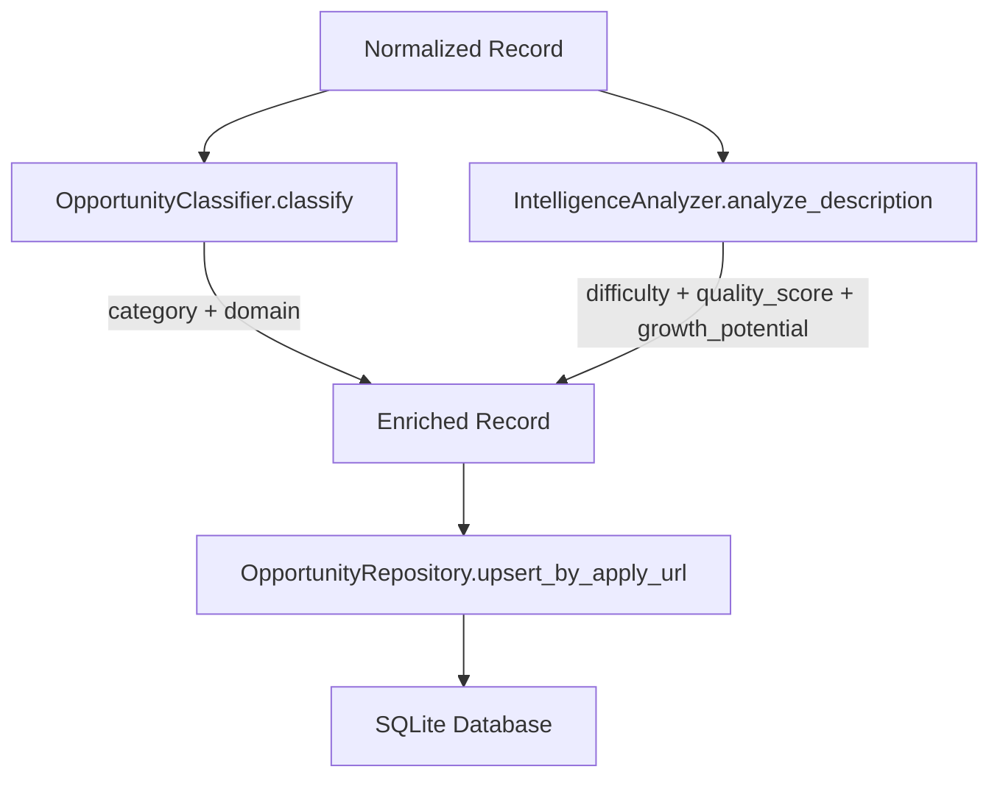
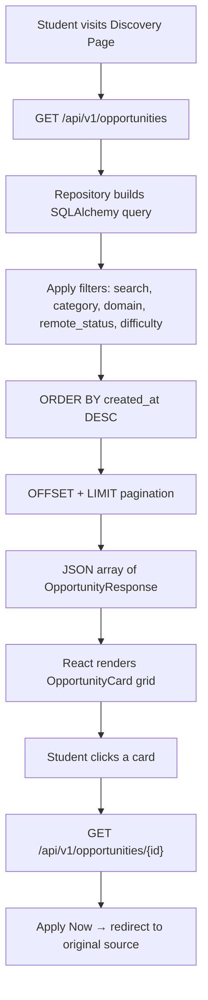
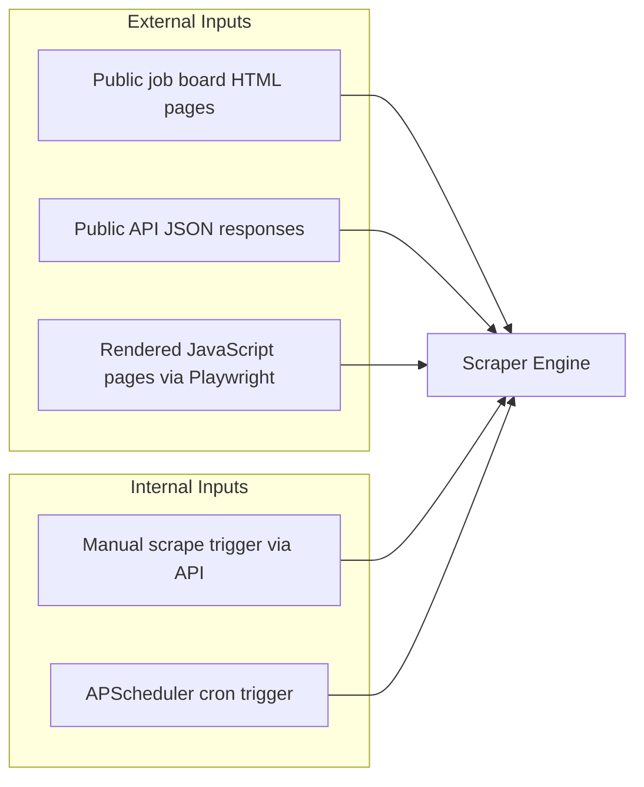
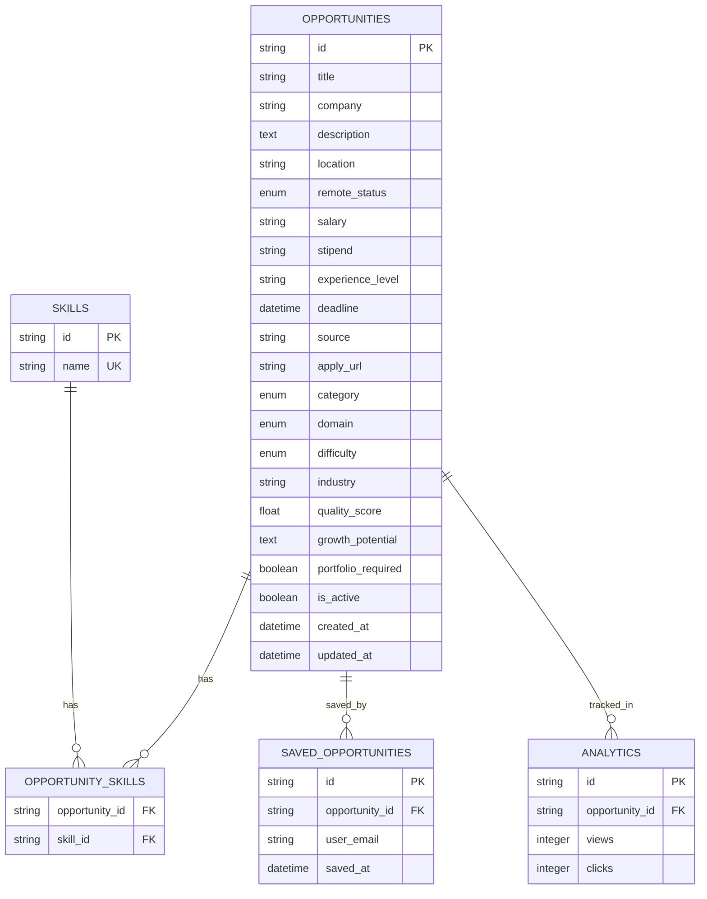
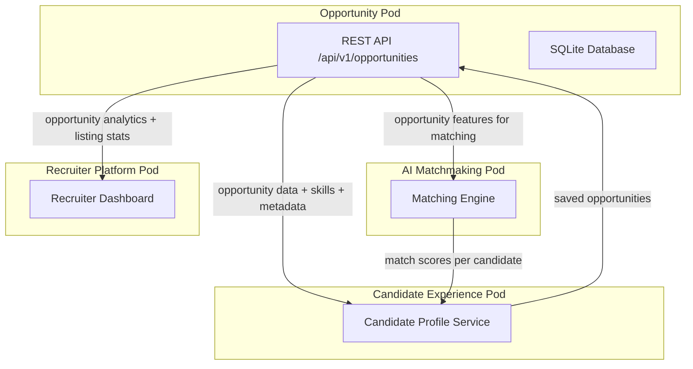
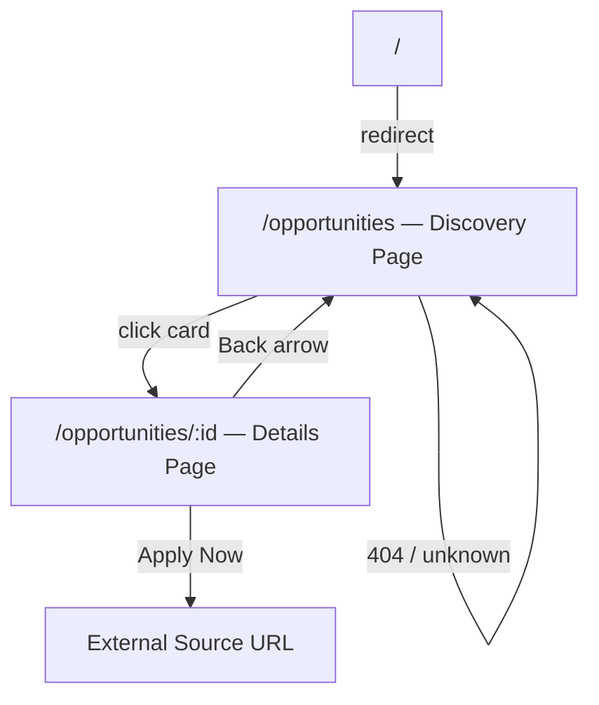
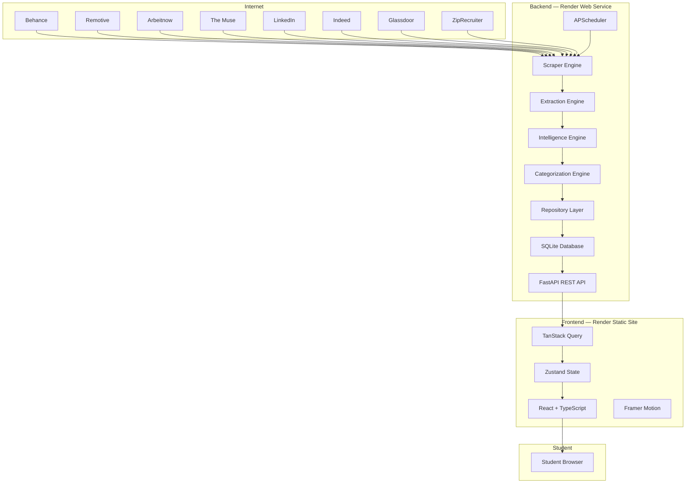
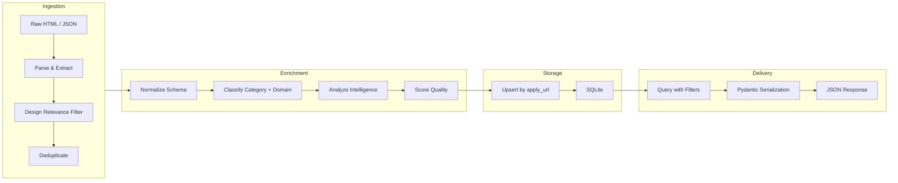

# Opportunity Intelligence & Discovery Pod — Complete Documentation

---

## 1. Pod Objective / Problem Statement

### Problem

Design students face a **fragmented opportunity landscape**. Internships, jobs, hackathons, fellowships, and competitions are scattered across dozens of disconnected platforms — Behance, Dribbble, LinkedIn, Indeed, Glassdoor, Internshala, and individual company career pages. Students waste hours manually browsing each source, often missing relevant opportunities because there is no single aggregation layer purpose-built for the design discipline.

### Objective

Build a **centralized Opportunity Intelligence & Discovery ecosystem** that:

- **Discovers** design-related opportunities from multiple public sources automatically
- **Extracts** structured metadata from raw listings (title, company, skills, location, compensation)
- **Classifies** each opportunity by category (Internship / Job / Hackathon / Fellowship / Competition / Freelance) and design domain (UI/UX / Graphic / Motion / Product / Brand / 3D)
- **Generates intelligence** — difficulty level, growth potential, quality score, portfolio requirements
- **Presents** a professional, searchable, filterable discovery interface
- **Redirects** students to the original application source with one click

> **Note:** This pod does **NOT** handle recruitment, ATS workflows, candidate applications, assessment engines, or matchmaking. Its sole responsibility is **opportunity discovery, intelligence generation, categorization, and redirection**.

---

## 2. Complete Workflow / Flow Diagram

### 2.1 — End-to-End System Flow



### 2.2 — Opportunity Collection Flow



**Key details:**

| Step | Logic |
|------|-------|
| Scrape | Each scraper class fetches HTML / JSON / API data from its platform |
| Deduplication | `dedupe_jobs()` — unique by `apply_url`, then by `title:company` key |
| Design Filter | `is_design_related()` — matches against 16 design keywords (figma, ux, designer, etc.) |
| Normalization | `normalize_job()` — maps raw fields → standard schema dict |

### 2.3 — Processing Flow



### 2.4 — Recommendation / Discovery Flow



---

## 3. Core Modules

| # | Module | File(s) | Responsibility |
|---|--------|---------|----------------|
| 1 | **Opportunity Collection Engine** | `base.py`, `behance.py`, `remotive.py`, `arbeitnow.py`, `the_muse.py`, `jobspy_scraper.py` | Fetch raw opportunity data from public sources |
| 2 | **Opportunity Extraction Engine** | `common.py` (`normalize_job`) | Convert raw listings into structured records |
| 3 | **Opportunity Intelligence Engine** | `analyzer.py` | NLP + rule-based analysis: difficulty, quality, growth potential |
| 4 | **Opportunity Categorization Engine** | `classifier.py` | Auto-classify category + design domain |
| 5 | **Data Persistence Layer** | `opportunity.py`, `skill.py`, `session.py` | SQLAlchemy models + database session management |
| 6 | **API Layer** | `opportunities.py` | FastAPI REST endpoints for CRUD + scrape triggers |
| 7 | **Scraping Orchestration Service** | `scraping_service.py` | Coordinates all scrapers, normalizes, classifies, and persists |
| 8 | **Background Task Scheduler** | `main.py` (APScheduler) | Scheduled background scraping every 6 hours |
| 9 | **Discovery UI** | `DiscoveryPage.tsx` | Search, filter, browse opportunity cards |
| 10 | **Details & Redirect UI** | `DetailsPage.tsx` | Full details + intelligence display + Apply Now redirect |

---

## 4. Features & Functionalities

### 4.1 — Opportunity Discovery

| Feature | Implementation |
|---------|----------------|
| Browse all opportunities | Paginated card grid on Discovery Page |
| Real-time scraping trigger | "Scrape latest jobs" button → `POST /api/v1/opportunities/scrape` |
| Animated card loading | Framer Motion fade-in transitions |
| Empty state handling | Friendly illustration + message when no results match |

### 4.2 — Search

| Feature | Implementation |
|---------|----------------|
| Full-text search | `ILIKE %query%` across `title`, `company`, `description` |
| Search as filter | Combined with all other active filters |
| Real-time filtering | Zustand store dispatches → API call → re-render |

### 4.3 — Categorization

| Feature | Implementation |
|---------|----------------|
| Auto-classification | `OpportunityClassifier.classify()` — keyword-based rule engine |
| Category types | Internship, Job, Hackathon, Fellowship, Competition, Freelance |
| Design domains | UX/UI, Graphic Design, Product Design, Motion Graphics, Industrial Design, Architecture, Other |
| Filter by category | Multi-select filter chips on Discovery Page sidebar |

### 4.4 — Intelligence

| Feature | Implementation |
|---------|----------------|
| Difficulty assessment | Beginner / Intermediate / Advanced — based on experience keywords |
| Quality score | Numerical score (0–10) based on listing completeness |
| Growth potential | High / Moderate — inversely correlated with difficulty |
| Portfolio detection | Boolean — scans description for "portfolio" keyword |
| Skill extraction | Identifies tools: Figma, Adobe Creative Suite, etc. |

### 4.5 — Analytics

| Feature | Implementation |
|---------|----------------|
| Click tracking | Analytics table tracks `views` and `clicks` per opportunity |
| Source distribution | Count of opportunities per source platform |
| Category breakdown | Count of opportunities per category |
| Scrape results reporting | API returns `{ fetched, created, updated }` per source |

### 4.6 — Notifications (Future)

| Feature | Status |
|---------|--------|
| New opportunity alerts | Planned — trigger when opportunities matching saved preferences are scraped |
| Deadline reminders | Planned — notify before expiration of saved opportunities |

---

## 5. Opportunity Sources

### 5.1 — Currently Supported Platforms

| Source | Scraper Class | Method |
|--------|---------------|--------|
| **Behance Jobs** | `BehanceScraper` | HTML parsing + JSON state extraction |
| **Remotive** | `RemotiveScraper` | Public API / HTML |
| **Arbeitnow** | `ArbeitnowScraper` | Public API / HTML |
| **The Muse** | `TheMuseScraper` | Public API / HTML |
| **LinkedIn** | `JobSpyScraper` | Via python-jobspy aggregation |
| **Indeed** | `JobSpyScraper` | Via python-jobspy aggregation |
| **Glassdoor** | `JobSpyScraper` | Via python-jobspy aggregation |
| **ZipRecruiter** | `JobSpyScraper` | Via python-jobspy aggregation |

### 5.2 — Design Communities

- Behance (primary design community with jobs board)
- Dribbble (planned — scraper stub ready)

### 5.3 — Company Career Pages

- Extensible via `BaseScraper` abstract class
- Any company page can be added as a new scraper module

### 5.4 — Public Opportunity Sources

- Remotive (remote-first job board)
- Arbeitnow (European job listings)
- The Muse (career platform with company profiles)

---

## 6. Opportunity Types

| Type | Database Value | Detection Keywords |
|------|---------------|-------------------|
| **Internship** | `internship` | "internship", "intern" |
| **Full-Time Job** | `job` | Default fallback when no other type matches |
| **Freelance** | `freelance` | "freelance", "contract" |
| **Hackathon** | `hackathon` | "hackathon" |
| **Competition** | `competition` | "competition" |
| **Fellowship** | `fellowship` | "fellowship" |
| **Campus Drive** | Planned | "campus", "placement drive" |

---

## 7. Inputs — What Data Enters the System



**Raw data fields ingested per listing:**

| Field | Source |
|-------|--------|
| `raw_title` | Page heading / JSON field |
| `company_name` | Listing metadata |
| `job_description` | Full text body |
| `job_location` | Location field or parsed from description |
| `salary` | Salary range if available |
| `url` | Direct link to original listing |
| `site` | Platform identifier (JobSpy only) |
| `date_posted` | Publication date if available |
| `tags` | Skill tags if available |

---

## 8. Outputs — What Information is Produced

### 8.1 — Direct Platform Outputs

| Output | Format | Consumer |
|--------|--------|----------|
| Opportunity listing cards | JSON → React UI | Design students |
| Opportunity detail view | JSON → React UI | Design students |
| Intelligence insights (difficulty, growth, quality) | JSON fields | Design students |
| Scrape status reports | JSON | Admin / dashboard |
| Redirect to original application | HTTP 302 / `target="_blank"` | Student browser |

### 8.2 — Data Sent to Candidate Pod (Integration Interface)

| Data | Description |
|------|-------------|
| `opportunity_id` | Unique identifier for cross-pod referencing |
| `title` | Opportunity title |
| `company` | Company name |
| `category` | Classified type (internship, job, etc.) |
| `domain` | Design domain (ux_ui, graphic_design, etc.) |
| `skills[]` | Required skills list |
| `difficulty` | Beginner / Intermediate / Advanced |
| `apply_url` | Original application link |

### 8.3 — Data Sent to Matchmaking Pod (Integration Interface)

| Data | Description |
|------|-------------|
| `opportunity_id` | Unique identifier |
| `skills[]` | Required skill set |
| `domain` | Design domain |
| `difficulty` | Difficulty level |
| `experience_level` | Required experience |
| `remote_status` | Remote / Hybrid / Onsite |
| `quality_score` | Intelligence quality rating |
| `growth_potential` | Career growth indicator |

---

## 9. Opportunity Metadata Extracted

Every opportunity stored in the database contains the following metadata:

| Metadata Field | DB Column | Type | Example |
|----------------|-----------|------|---------|
| **Title** | `title` | `STRING NOT NULL` | "UI/UX Design Intern" |
| **Company** | `company` | `STRING` | "Adobe" |
| **Description** | `description` | `TEXT` | Full job description |
| **Skills** | `skills` (M2M) | `Skill[]` | ["Figma", "Adobe XD", "Research"] |
| **Location** | `location` | `STRING` | "Bangalore, India" |
| **Work Type** | `remote_status` | `ENUM(remote, hybrid, onsite)` | "remote" |
| **Salary** | `salary` | `STRING` | "₹25,000 – ₹40,000/month" |
| **Stipend** | `stipend` | `STRING` | "₹15,000/month" |
| **Experience Level** | `experience_level` | `STRING` | "0-1 years" |
| **Difficulty** | `difficulty` | `ENUM(beginner, intermediate, advanced)` | "beginner" |
| **Deadline** | `deadline` | `DATETIME` | "2026-07-15T00:00:00" |
| **Apply URL** | `apply_url` | `STRING` | "https://behance.net/joblist/12345" |
| **Source** | `source` | `STRING` | "Behance" |
| **Category** | `category` | `ENUM(internship, job, hackathon, ...)` | "internship" |
| **Domain** | `domain` | `ENUM(ux_ui, graphic_design, ...)` | "ux_ui" |
| **Quality Score** | `quality_score` | `FLOAT` | 8.5 |
| **Growth Potential** | `growth_potential` | `TEXT` | "High" |
| **Portfolio Required** | `portfolio_required` | `BOOLEAN` | true |
| **Active Status** | `is_active` | `BOOLEAN` | true |
| **Created At** | `created_at` | `DATETIME` | Auto-generated |
| **Updated At** | `updated_at` | `DATETIME` | Auto-updated |

---

## 10. Search & Recommendation Logic

### 10.1 — Search Implementation

```
User Input: "figma intern remote"
         ↓
API: GET /api/v1/opportunities?search=figma+intern+remote
         ↓
Repository: WHERE title ILIKE '%figma intern remote%'
              OR company ILIKE '%figma intern remote%'
              OR description ILIKE '%figma intern remote%'
         ↓
Combined with active filters (category, domain, remote_status, difficulty)
         ↓
ORDER BY created_at DESC
         ↓
OFFSET + LIMIT pagination
```

### 10.2 — Ranking Logic

Opportunities are currently ranked by **recency** (`created_at DESC`). Future ranking enhancements:

| Factor | Weight | Description |
|--------|--------|-------------|
| Recency | Primary | Newest opportunities appear first |
| Quality Score | Secondary (planned) | Higher intelligence scores rank higher |
| Relevance Match | Tertiary (planned) | Keyword match density in title vs description |
| Deadline Proximity | Quaternary (planned) | Expiring soon → boosted |

### 10.3 — Filter Combination

All filters are applied as **AND** conditions. Within a single filter type (e.g., multiple categories), values are combined with **OR**:

```
WHERE (category IN ('internship', 'fellowship'))   -- OR within filter
  AND (domain IN ('ux_ui'))                         -- AND across filters
  AND (remote_status IN ('remote'))                 -- AND across filters
  AND (title ILIKE '%search%' OR ...)               -- AND with search
```

---

## 11. Database Requirements

### 11.1 — Entity Relationship Diagram



### 11.2 — Tables Summary

| Table | Records Stored | Primary Key |
|-------|---------------|-------------|
| `opportunities` | All scraped and enriched design opportunities | UUID |
| `skills` | Unique skill names (Figma, Adobe XD, etc.) | UUID |
| `opportunity_skills` | Many-to-many junction | Composite (opportunity_id, skill_id) |
| `saved_opportunities` | Student bookmarks | UUID |
| `analytics` | View and click counts per opportunity | UUID |

### 11.3 — PostgreSQL Migration Path

The schema is designed for SQLite MVP with PostgreSQL readiness:
- All IDs are `STRING` UUIDs (not auto-increment integers)
- ENUMs are declared via SQLAlchemy `Enum()` (portable)
- `check_same_thread=False` is SQLite-specific and conditionally applied
- No SQLite-specific SQL is used

---

## 12. Integrations

### 12.1 — Integration Architecture



### 12.2 — Candidate Experience Pod

| Integration Point | Direction | Data |
|-------------------|-----------|------|
| Opportunity listing feed | Opportunity → Candidate | Full opportunity records |
| Save/bookmark opportunity | Candidate → Opportunity | `saved_opportunities` table |
| View tracking | Candidate → Opportunity | Increment `analytics.views` |

### 12.3 — AI Matchmaking Pod

| Integration Point | Direction | Data |
|-------------------|-----------|------|
| Opportunity feature vector | Opportunity → Matchmaking | skills, domain, difficulty, experience_level, remote_status |
| Match results display | Matchmaking → Opportunity | Match score overlaid on opportunity cards |

### 12.4 — Recruiter Platform Pod

| Integration Point | Direction | Data |
|-------------------|-----------|------|
| Opportunity analytics | Opportunity → Recruiter | views, clicks, save counts |
| Source performance | Opportunity → Recruiter | Opportunities per source, conversion rates |

---

## 13. Screens / UI Flow

### 13.1 — Screen Map



### 13.2 — Discovery Screen

| Element | Description |
|---------|-------------|
| **Page Header** | Title "Design Opportunities" + subtitle + scrape button |
| **Sidebar Filters** | Category, Domain, Remote Status, Difficulty — multi-select dropdowns |
| **Search Bar** | Text input with debounced search |
| **Opportunity Cards Grid** | Single-column responsive card list |
| **Card Content** | Title, Company, Location, Category badge, Domain badge, Remote badge, Source, Posted date |
| **Empty State** | SVG illustration + "No opportunities found" + filter adjustment suggestion |
| **Loading State** | Centered spinner animation |
| **Error State** | Red alert box with error message |

### 13.3 — Opportunity Details Screen

| Element | Description |
|---------|-------------|
| **Back Navigation** | "← Back to all opportunities" link |
| **Header Section** | Title (h1), Company • Location, Category/Domain/Remote badges |
| **Apply Now Button** | Primary CTA → opens original source in new tab |
| **About the Role** | Full description in prose layout |
| **Required Skills** | Pill badges for each skill |
| **Key Details Sidebar** | Compensation, Experience Level, Difficulty, Deadline, Source, Portfolio Required |
| **Intelligence Insights Card** | Indigo-tinted card showing Growth Potential |

---

## 14. Architecture Diagram

### 14.1 — High-Level Architecture



### 14.2 — Data Flow Architecture



---

## 15. Tech Stack

### Backend

| Technology | Version | Purpose |
|-----------|---------|---------|
| **Python** | 3.12+ | Core language |
| **FastAPI** | 0.110.0 | REST API framework |
| **Uvicorn** | 0.29.0 | ASGI server |
| **Gunicorn** | 21.2.0 | Production process manager |
| **SQLAlchemy** | 2.0.29 | ORM & database toolkit |
| **Pydantic** | 2.6.4 | Data validation & serialization |
| **APScheduler** | 3.10.4 | Background task scheduling |
| **BeautifulSoup4** | 4.12.3 | HTML parsing |
| **Requests** | 2.31.0 | HTTP client |
| **Playwright** | 1.42.0 | JavaScript-rendered page scraping |
| **Pandas** | 2.2.1 | Data manipulation |
| **python-jobspy** | ≥1.1.0 | Multi-platform job aggregation |

### Frontend

| Technology | Version | Purpose |
|-----------|---------|---------|
| **React** | 18.2 | UI framework |
| **TypeScript** | 5.2 | Type safety |
| **Vite** | 5.2 | Build tool & dev server |
| **Tailwind CSS** | 3.4 | Utility-first styling |
| **Framer Motion** | 11.0 | Animations & transitions |
| **TanStack Query** | 5.28 | Server state management |
| **Zustand** | 4.5 | Client state management |
| **React Router** | 6.22 | Client-side routing |
| **React Hook Form** | 7.51 | Form management |
| **Recharts** | 2.12 | Dashboard charts |
| **Lucide React** | 0.359 | Icon library |

### Database

| Technology | Purpose |
|-----------|---------|
| **SQLite** | MVP database (PostgreSQL-migration-ready) |

### Deployment

| Component | Platform | Configuration |
|-----------|----------|---------------|
| Backend | Render Web Service | `gunicorn app.main:app -k uvicorn.workers.UvicornWorker` |
| Frontend | Render Static Site | `npm run build` → serve `dist/` |
| Config | `render.yaml` | Blueprint deployment manifest |

---

## 16. Future Scope

| Priority | Feature | Description |
|----------|---------|-------------|
| 🔴 High | **PostgreSQL migration** | Move from SQLite to managed PostgreSQL for production scale |
| 🔴 High | **Full-text search engine** | Replace ILIKE with PostgreSQL `tsvector` or Elasticsearch |
| 🔴 High | **User authentication** | JWT-based auth for saved opportunities and preferences |
| 🟠 Medium | **Advanced intelligence** | NLP-based skill extraction using spaCy or sentence-transformers |
| 🟠 Medium | **Recommendation engine** | Collaborative filtering based on saved/viewed opportunities |
| 🟠 Medium | **Email notifications** | Alert students when new opportunities match their profile |
| 🟠 Medium | **Additional scrapers** | Dribbble, Internshala, Wellfound, AngelList career pages |
| 🟡 Low | **Admin dashboard** | Recharts-powered analytics: trends, source breakdown, category distribution |
| 🟡 Low | **Opportunity expiration** | Auto-deactivate listings past deadline |
| 🟡 Low | **Infinite scroll** | Replace pagination with scroll-triggered loading |
| 🟡 Low | **PWA support** | Offline access and push notifications |
| 🟢 Stretch | **AI-powered matching** | Integration with Matchmaking Pod for personalized rankings |
| 🟢 Stretch | **Recruiter posting API** | Allow companies to submit opportunities directly |
| 🟢 Stretch | **Multi-language support** | i18n for global design student communities |

---

> **Note:** This documentation reflects the current state of the MVP as deployed on Render. All integration interfaces (Candidate Pod, Matchmaking Pod, Recruiter Pod) are defined as contracts and will be implemented when those pods are built.

## Getting Started (Local Development)

### Prerequisites
- Node.js (for frontend)
- Python 3.12+ (for backend)

### Backend Setup
1. `cd backend`
2. Create virtual environment: `python -m venv venv`
3. Activate: `source venv/bin/activate` (Linux/Mac) or `venv\Scripts\activate` (Windows)
4. Install deps: `pip install -r requirements.txt`
5. Run server: `uvicorn app.main:app --reload`

### Frontend Setup
1. `cd frontend`
2. Install deps: `npm install`
3. Create `.env` file with `VITE_API_URL=http://localhost:8000`
4. Run dev server: `npm run dev`

